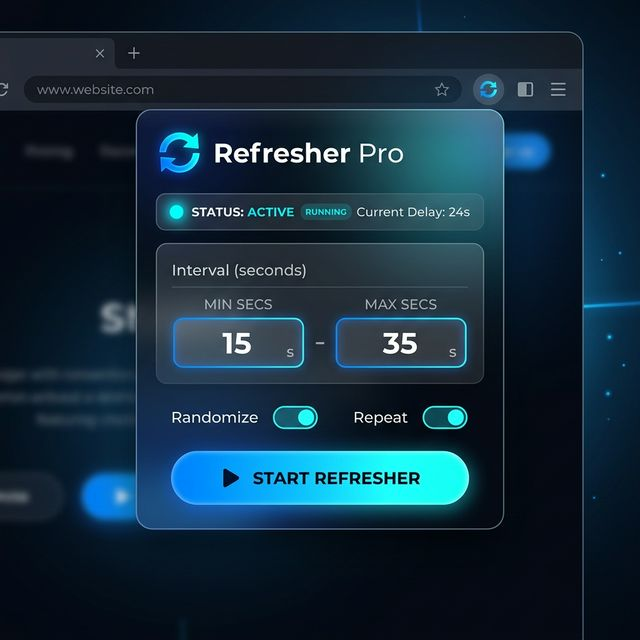

# 🔄 Refresher Pro

A premium, modern Chrome Extension to automatically refresh your web pages at random intervals. Built with **Manifest V3** for maximum privacy and performance.



## ✨ Features

- **🎯 Random Intervals**: Set a Minimum and Maximum duration (in seconds) for each refresh cycle.
- **🔒 Tab Locking**: Automatically "locks" onto the tab where you start the refresher. Continue browsing manually in other tabs without interruption!
- **💎 Premium Design**: Sleek dark mode interface with glassmorphism, smooth gradients, and micro-animations.
- **🔋 Battery Efficient**: Uses `chrome.alarms` to handle scheduling, allowing the extension to "sleep" when not active.
- **⚡ Real-time Sync**: Live countdown display in the popup that syncs perfectly with the background process.

## 🚀 Installation

Since this is currently in development (or if you are installing from source):

1. **Clone the repository**:
   ```bash
   git clone https://github.com/taskinnasif144/Refresher-Pro.git
   ```
2. **Open Chrome Extensions**: Go to `chrome://extensions/` in your browser.
3. **Enable Developer Mode**: Toggle the switch in the top-right corner.
4. **Load Unpacked**: Click the "Load unpacked" button and select the project folder.

## 🛠️ Usage

1. Click the **Refresher Pro** icon in your Chrome toolbar.
2. Enter your desired **Min** and **Max** refresh intervals (e.g., 30s to 60s).
3. Click **Start Refresher**.
4. The extension will now "lock" to your current tab and reload it at random time intervals.
5. Feel free to switch to other tabs! Refresher Pro will keep your target tab alive in the background.

## 🧠 Tech Stack

- **Core**: JavaScript ES6+
- **Styling**: Vanilla CSS (Custom Glassmorphism Design System)
- **API**: Chrome Extension APIs (Storage, Alarms, Tabs, Runtime)
- **Manifest**: V3 (Privacy-first architecture)

---

Developed with ❤️ by [Taskin Nasif](https://github.com/taskinnasif144)
